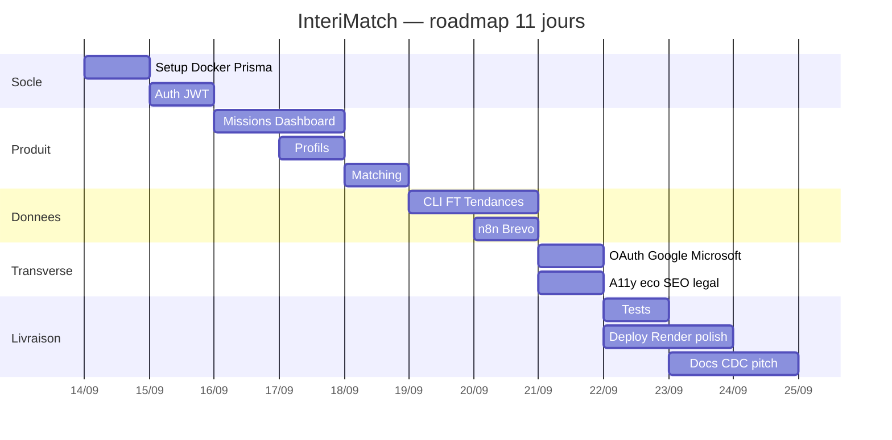

# Diagramme de Gantt — InteriMatch

Roadmap sur 11 jours (14–24 septembre 2026).

```mermaid
gantt
    title InteriMatch — roadmap 11 jours
    dateFormat  YYYY-MM-DD
    axisFormat  %d/%m
    section Socle
    Setup Docker Prisma           :a1, 2026-09-14, 1d
    Auth JWT                      :a2, 2026-09-15, 1d
    section Produit
    Missions Dashboard            :b1, 2026-09-16, 2d
    Profils                       :b2, 2026-09-17, 1d
    Matching                      :b3, 2026-09-18, 1d
    section Donnees
    CLI FT Tendances              :c1, 2026-09-19, 2d
    n8n Brevo                     :c2, 2026-09-20, 1d
    section Transverse
    OAuth Google Microsoft        :d1, 2026-09-21, 1d
    A11y eco SEO legal            :d2, 2026-09-21, 1d
    section Livraison
    Tests                         :e1, 2026-09-22, 1d
    Deploy Render polish          :e2, 2026-09-22, 2d
    Docs CDC pitch                :e3, 2026-09-23, 2d
```

Fichier image : `gantt-interimatch.png`
