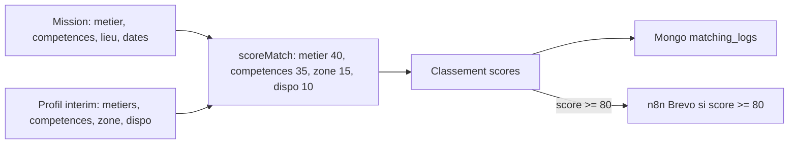

# Schéma matching InteriMatch (soutenance)

```mermaid
flowchart LR
  mission["Mission: metier, competences, lieu, dates"]
  profil["Profil interim: metiers, competences, zone, dispo"]
  score["scoreMatch: metier 40, competences 35, zone 15, dispo 10"]
  rank["Classement scores"]
  mongo["Mongo matching_logs"]
  n8n["n8n Brevo si score >= 80"]

  mission --> score
  profil --> score
  score --> rank
  rank --> mongo
  rank -->|"score >= 80"| n8n
```
